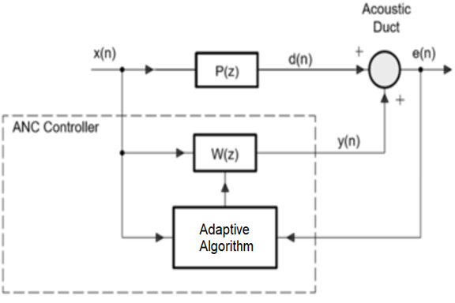
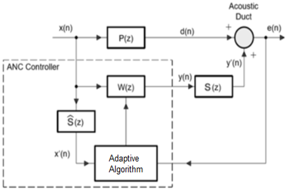

# Active Noise Cancellation Using Filtered Adaptive Algorithms
Over the past decade, significant attention has been dedicated to developing practical applications for Active Noise Cancellation (ANC) technology, aimed at addressing noise pollution across multiple domains, including the field of audio. By leveraging adaptive signal processing, ANC, a widely used and advanced technology, is implemented on high-performance digital signal processing (DSP) boards. This technique offers an alternative approach for estimating signals that have been corrupted by additive noise or interference. Fundamentally, ANC involves generating an electro-acoustic sound field to effectively neutralize unwanted noise.

### Table of Contents
- [Project Overview](#project-overview)
- [Structure](#structure)
- [Adaptive Algorithms](#adaptive-algorithms)
- [Filtered Adaptive Algorithms](#filtered-adaptive-algorithms)
- [Dataset](#dataset)
- [Execution](#execution)
- [Configuration](#configuration)
- [Installation](#installation)
- [Conclusion](#conclusion)

### Project Overview
This project focuses on exploring the potential applications of the ANC methodology through the implementation of ANC systems in MatLab, utilizing adaptive algorithms (LMS, NLMS, RLS) as well as filtered adaptive algorithms (FxLMS, FxNLMS, FxRLS). The performance of these algorithms will be evaluated through a comparison with a Wiener Filter, utilizing both simulated and real signals.

### Structure
```
├── config                      <-- Config Folder
|   └── *.txt                   <-- Config Files
|
├── data                        <-- Data Folder
|   └── *.mat                   <-- Data Files
|
├── images                      <-- Images Folder
|   └── *.png                   <-- Images Files
|
├── logs                        <-- Logs Folder
|   └── *.txt                   <-- Log Files
|
├── plots                       <-- Plots Folder
|   └── *.png                   <-- Plots Files
|
├── results                     <-- Results Folder
|   └── *.csv                   <-- Results Files
|
├── src                         <-- Source Folder
|   └── *.m                     <-- Source Files
|
├── .gitignore                  <-- Git Ignore Configuration
|
├── flowchart.wsd               <-- Pipeline Flowchart
|
├── readme.md                   <-- You Are Here
|
├── run.m                       <-- Main Matlab Script
```

### Adaptive Algorithms


The concept of an adaptive system is illustrated above, which comprises an adjustable filter that takes a reference signal input `x(n)` and generates an anti-noise filter output `y(n)`. The objective is to minimize the estimated error `e(n)`, which signifies the difference between the desired response signal d(n) and the generated `y(n)`. Once the difference is calculated, the algorithm adapts the filter coefficients based on the difference. In this context, `P(z)` and `W(z)` represent the impulse response of the primary path and the estimated filter weights, respectively.

### Filtered Adaptive Algorithms


The above diagram depicts the impulse response filter of the secondary path, denoted by `S(z)`, and its estimated filter, `ˆS(z)`, which compensates for secondary path effects. The impulse response filter of the secondary path can be estimated by inputting a sequence of training data. In order to obtain `S(z)`, the system needs to be tested offline before implementing ANC. One way to achieve this is by utilizing the LMS algorithm and feeding white noise as input to the system. The estimated filter, `ˆS(z)`, is the inverse of the impulse response filter, obtained by transforming the impulse response of the secondary path into the frequency domain, taking its inverse, and then bringing it back into the time domain. Subsequently, the algorithm processes a filtered reference signal input, denoted as `x′(n)`, and computes the estimated error, `e(n)`, which is the difference between the desired response signal, `d(n)`, and the anti-noise filtered output, `y′(n)`.

### Dataset
In this context, the input signal, denoted as `x(n)`, is generated from the `noise.mat` file, while the speech signal, represented by `speech.mat`, is added to the desired signal, `d(n)`. It is crucial for the noise signal to be uncorrelated with the speech signal, as otherwise, the algorithms may inadvertently remove portions of the speech signal. To prevent this, the signals must be distinguishable. Additionally, the impulse response filter of the primary path, `P(z)`, is derived from the `bpir.mat` file. The recorded audio data is stored in the `rec.mat` file, which users themselves can update.

### Exectuion
Execute `run.m` to initiate the entire pipeline.

### Configuration
Parameters and paths can be specified in the `config.txt` file.

### Installation
To get started with this project, ensure that you have MATLAB installed on your system. Follow the official [MATLAB installation guide](https://www.mathworks.com/help/install/eg/install-mathworks-software.html) for help with the installation process.

Clone the repository to your local machine and navigate to the project's root directory to access all the necessary files and scripts.

### Conclusion
Obtaining the most feasible result of the adaptive algorithms is contingent upon identifying the optimal parameter values, which can prove challenging, considering the multitude of variables that must be considered. The selection of the appropriate algorithm hinges on the desired outcome. While filtered adaptive algorithms demonstrate improved error floor performance, their convergence speed is slower when compared to non-filtered adaptive algorithms.
